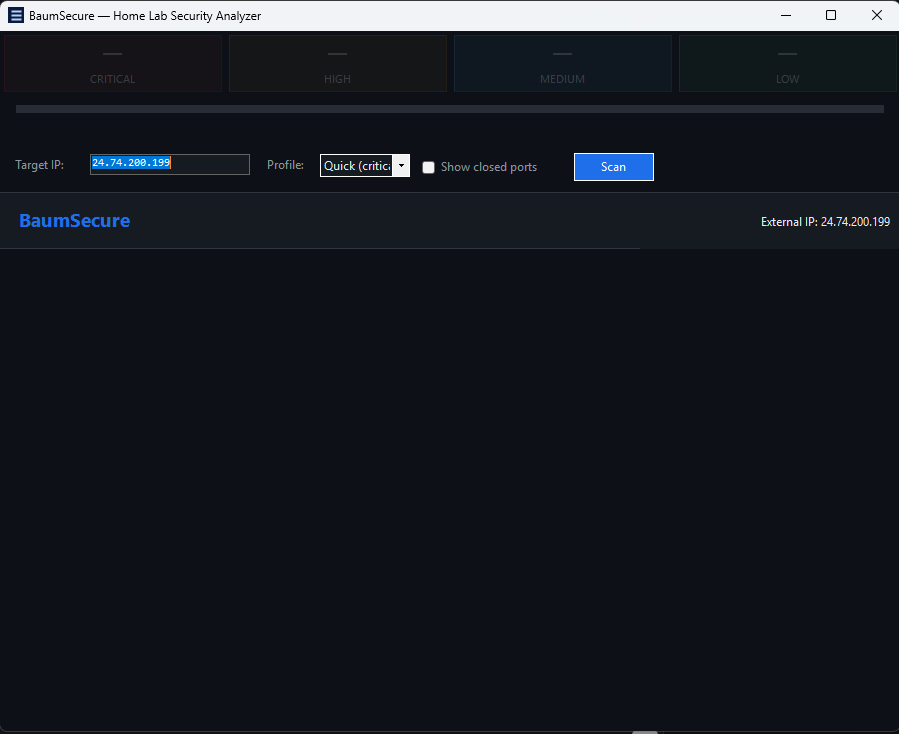

# BaumSecure

A Windows desktop app that analyzes your home lab's external attack surface — scanning for open ports and flagging common security misconfigurations.

Point it at your external IP and get an instant, prioritized list of what the internet can see and why it matters.

---

## Screenshot



---

## What it does

BaumSecure performs a TCP port scan against your external (WAN) IP and evaluates each open port against a built-in library of security rules covering common home lab mistakes. Results are grouped by severity so you know exactly what to fix first.

**Detected risks include:**

| Category | Examples |
|----------|----------|
| Unencrypted protocols | FTP (21), Telnet (23), plain HTTP (80), POP3, IMAP |
| Remote access | RDP (3389), VNC (5900), SSH (22) without key auth |
| Database exposure | MySQL (3306), PostgreSQL (5432), MongoDB (27017), Redis (6379), Elasticsearch (9200) |
| Container/orchestration | Docker daemon (2375/2376), Kubernetes Kubelet (10250), etcd (2379) |
| Windows services | SMB (445), NetBIOS (139), MSRPC (135) |
| Management UIs | Proxmox (8006), Jupyter Notebook (8888), Prometheus (9090), Portainer (9000) |
| Amplification targets | Memcached (11211), UPnP/SSDP (1900) |

Each finding includes:
- **Severity** (Critical / High / Medium / Low)
- **Description** of why this is a problem
- **Recommendation** with concrete steps to fix it
- **Banner grab** showing what the service is actually returning

---

## Requirements

- Windows 10 22621+ (Windows 11 recommended)
- .NET 8 Runtime ([download](https://dotnet.microsoft.com/download/dotnet/8.0))

No admin privileges required. No external tools (nmap, etc.) needed — BaumSecure uses pure .NET TCP connect scanning.

---

## Usage

1. Launch BaumSecure — it auto-detects your external IP via [ipify.org](https://api.ipify.org)
2. Confirm or replace the target IP
3. Choose a scan profile:
   - **Quick** — checks Critical and High severity ports only (~20 ports, fast)
   - **Full** — checks all rules (~35 ports)
4. Click **Scan**
5. Review findings — click any row to expand the description and remediation advice

---

## Scan Profiles

| Profile | Ports checked | Use when |
|---------|--------------|----------|
| Quick | ~20 (Critical + High severity) | Fast daily check |
| Full | ~35 (all rules) | Periodic thorough audit |

---

## Security Rules

Rules are defined in `Services/SecurityAnalyzer.cs` as a static list. Each rule specifies:

```csharp
new SecurityRule(
    Port:           6379,
    Protocol:       "TCP",
    ServiceName:    "Redis",
    Severity:       Severity.Critical,
    Title:          "Redis exposed — typically unauthenticated",
    Description:    "Redis defaults to no authentication...",
    Recommendation: "Bind Redis to 127.0.0.1 only..."
)
```

Adding new rules is straightforward — extend the list in `SecurityAnalyzer.cs`.

---

## Building from Source

Requires [.NET 8 SDK](https://dotnet.microsoft.com/download/dotnet/8.0).

```bash
cd BaumSecure
dotnet build
dotnet run --project BaumSecure/BaumSecure.csproj
```

---

## Architecture

```
BaumSecure/
├── Models/
│   ├── SecurityRule.cs      # Rule definition + Severity enum
│   ├── SecurityFinding.cs   # Rule + scan result (open/closed + banner)
│   └── ScanResult.cs        # Full scan output with aggregated counts
├── Services/
│   ├── ExternalIpService.cs # Detects WAN IP via ipify/ifconfig.me/icanhazip
│   ├── PortScanService.cs   # Async concurrent TCP connect scanner + banner grab
│   └── SecurityAnalyzer.cs  # Rule database + profile definitions
├── Controls/
│   ├── FindingRow.cs        # Owner-drawn expandable finding row
│   └── SummaryBar.cs        # Critical/High/Medium/Low count tiles
├── AppTheme.cs              # Dark theme colours, fonts, dark scrollbar helper
└── MainForm.cs              # Main window — config, progress, findings list
```

The scanner uses async/await with a `SemaphoreSlim` to run up to 64 TCP probes concurrently. Results stream back to the UI via an event as each port completes, so you see findings appear in real time.

---

## Limitations

- **TCP only** — UDP services (SNMP port 161, DNS port 53, NTP port 123, UPnP/SSDP port 1900) cannot be probed with a simple TCP connect. UDP findings are noted in the rule library for awareness but are not actively scanned.
- **Hairpin NAT** — scanning your own external IP from inside your network requires your router to support NAT hairpinning (loopback). Most modern routers do; some do not. If results seem wrong, verify from an external vantage point.
- **Firewalls** — some ISPs silently drop certain inbound ports regardless of your router config. An "open" result confirms the port is reachable; a "closed" result means it was not reachable from this scan, not necessarily that the service doesn't exist.

---

## License and Project Status

This repository is a personal project shared publicly for learning, reference, portfolio, and experimentation purposes.

Development may include AI-assisted ideation, drafting, refactoring, or code generation. All code and content published here were reviewed, selected, and curated before release.

This project is licensed under the Apache License 2.0. See the LICENSE file for details.

Unless explicitly stated otherwise, this repository is provided as-is, without warranty, support obligation, or guarantee of suitability for production use.

Any third-party libraries, assets, icons, fonts, models, or dependencies used by this project remain subject to their own licenses and terms.
